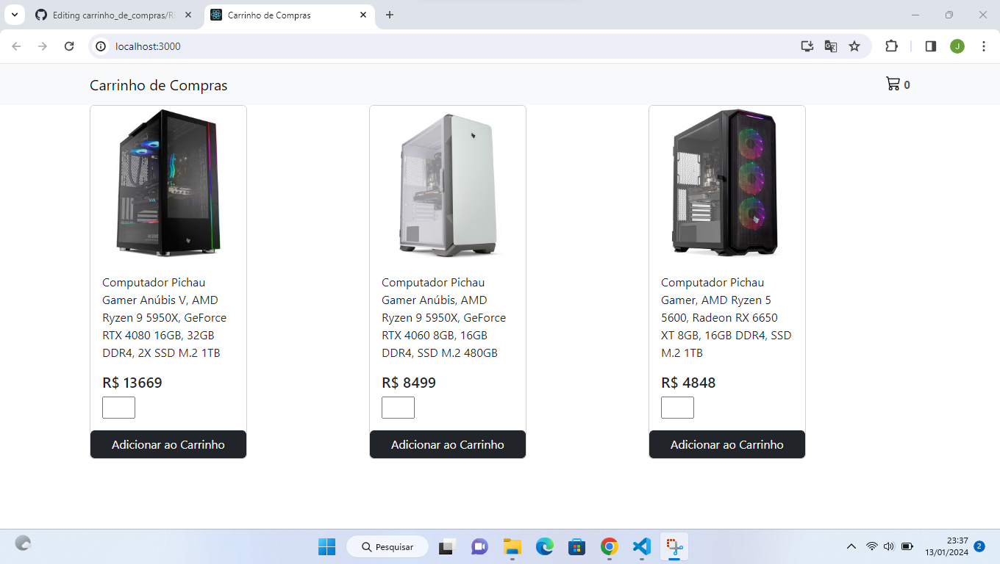
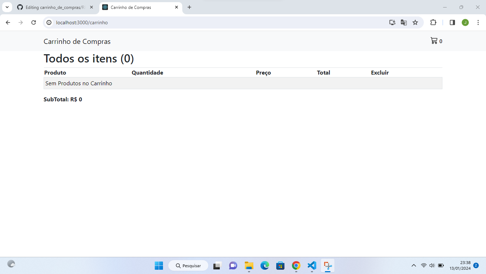
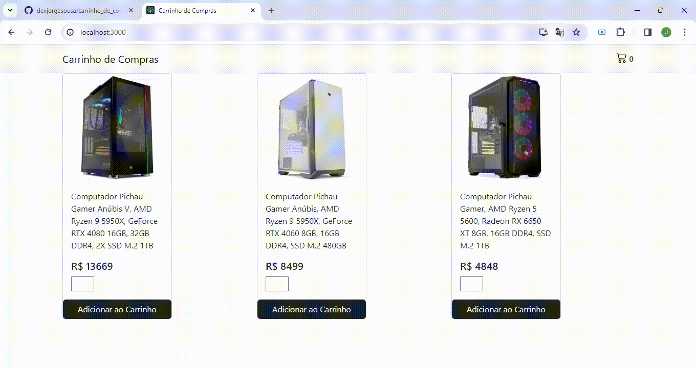

# Carrinho de Compras

#### Um carrinho de compras feito com React.js.




##### Demonstração:
 


##### Link do projeto hospedado no Vercel: https://carrinho-de-compras-azure.vercel.app/

## 🛠 Tecnologias e Ferramentas usadas na construção do projeto:

- [Visual Studio Code](https://code.visualstudio.com/)

- [Node.js](https://nodejs.org/en/)
- Dependências do Projeto em ReactJS(package.json)  
```
"dependencies": {
    "@testing-library/jest-dom": "^5.17.0",
    "@testing-library/react": "^13.4.0",
    "@testing-library/user-event": "^13.5.0",
    "bootstrap": "^5.3.2",
    "react": "^18.2.0",
    "react-bootstrap": "^2.9.1",
    "react-dom": "^18.2.0",
    "react-router-dom": "^6.17.0",
    "react-scripts": "5.0.1",
    "web-vitals": "^2.1.4"
  },
```

## 🎲 Rodando o Projeto 

###### 1ª Clone este repositório
* git clone https://github.com/devjorgesousa/carrinho_de_compras.git

###### 2ª Acesse a pasta do projeto no terminal/cmd ou Visual Studio Code, após descompactar o arquivo carrinho_de_compras-main.zip.
* cd carrinho_de_compras-main

###### 3ª Instale as dependências.
* npm install

###### 4ª Execute a aplicação.
* npm start

###### 5ª O projeto iniciará na porta: 3000 - Acesse: http://localhost:3000


